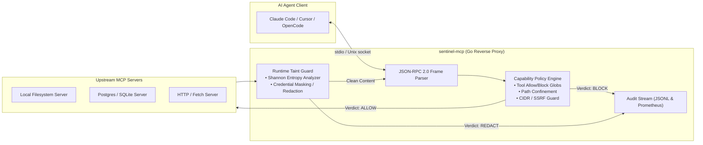

# 014 — sentinel-mcp: Capability-Gated Security Reverse Proxy & Taint Guard for MCP

> **Target Standalone Repo:** `github.com/pritkr/sentinel-mcp` (MIT License)  
> **Target Alignment:** Pragmatike (Go AI Security), RightWalk Foundation (Go backend agent loop + MCP), Cursor (AI IDE agent tooling), Robinhood (Offensive Security).  
> **Identity:** Ultra-low latency, zero-cloud security proxy for the Model Context Protocol (MCP) in Go.

---

## 1. Executive Summary & Threat Model

As AI agents (Claude Code, Cursor, OpenCode, Aider) adopt the **Model Context Protocol (MCP)**, tool execution shifts from sandboxed prompts to real operating systems. This introduces severe attack vectors:
1. **Prompt Injection Data Exfiltration:** Malicious instructions in ingested documents trick the LLM into invoking tools that read `~/.ssh/id_rsa`, `.env`, or AWS credentials and exfiltrate them.
2. **Server-Side Request Forgery (SSRF):** Tool calls targeting private networks (`10.0.0.0/8`, `192.168.0.0/16`, `127.0.0.1`) or cloud metadata (`169.254.169.254`).
3. **Arbitrary Filesystem Traversal:** Path escape (`../../etc/passwd`) via unsanitized file reading tools.
4. **Rogue or Compromised MCP Servers:** Malicious third-party tool servers returning high-entropy payloads or altering tool signatures.

`sentinel-mcp` is a transparent, capability-gated reverse proxy written in pure Go. It sits between the agent client and MCP servers over standard I/O (`stdio`), Unix sockets, or SSE/HTTP, evaluating every JSON-RPC 2.0 message in real-time with sub-millisecond overhead.

---

## 2. System Architecture



---

## 3. Mathematical & Algorithmic Formulations

### 3.1 Real-Time Shannon Entropy Anomaly Detection
Tool responses are analyzed for cryptographic secrets (Base64/Hex API keys, private keys, JWTs) using empirical Shannon Entropy:

$$H(X) = - \sum_{i=1}^{n} P(x_i) \log_2 P(x_i)$$

Where:
- $P(x_i) = \frac{\text{count}(x_i)}{N}$ is the byte frequency in string tokens with length $L \ge 20$.
- Standard natural language text in code exhibits $H(X) \approx 2.8 - 3.8\text{ bits/byte}$.
- High-entropy cryptographic secrets (e.g. AWS access keys, SSH RSA private keys) exhibit $H(X) \ge 4.5\text{ bits/byte}$.
- When $H(X) > \text{threshold}$ (default: `4.5`), the response is flagged, redacted with `[REDACTED_BY_SENTINEL]`, and an audit event is dispatched.

### 3.2 Path Confinement & Traversal Invariant
Every path argument is canonically resolved against the OS root:

$$\text{CleanPath}(P) = \text{filepath.Clean}(\text{Abs}(P))$$
$$\text{Confinement}(P, W) \iff \exists w \in W : \text{HasPrefix}(\text{CleanPath}(P), w)$$

If $P$ violates the confinement set $W$ or contains banned tokens (`.env`, `id_rsa`, `.aws`), the tool execution request is immediately rejected at the proxy layer with JSON-RPC error code `-32001` (Security Violation) without ever invoking the upstream process.

---

## 4. Standalone Repository Blueprint

```
sentinel-mcp/
├── .github/
│   └── workflows/
│       ├── ci.yml                 # go test, golangci-lint, race detector
│       └── release.yml            # goreleaser binary matrix (macOS, Linux, arm64, x86_64)
├── cmd/
│   └── sentinel/
│       └── main.go                # Full CLI entrypoint (proxy, check, audit, metrics)
├── pkg/
│   ├── mcp/                       # JSON-RPC 2.0 protocol definitions & streaming
│   ├── policy/                    # YAML/JSON policy parser, CIDR & path validators
│   ├── guard/                     # Taint analyzer & Shannon entropy detector
│   ├── audit/                     # JSONL audit logger & Prometheus /metrics exporter
│   └── proxy/                     # Stdio, Unix socket, and subprocess process manager
├── examples/
│   ├── policies/                  # default-policy.json, strict-policy.json, dev-policy.json
│   └── demo_agent.sh              # Interactive demonstration script
├── Dockerfile                     # Multi-stage scratch build (<15MB container)
├── Makefile                       # build, test, lint, release targets
├── LICENSE                        # MIT License
└── README.md                      # Architecture, threat model, benchmarks & quickstart
```

---

## 5. Work Breakdown by Aspect

- **Aspect A (Core Engine & Security):** JSON-RPC streaming over stdio and Unix sockets, capability policy engine, entropy taint detection.
- **Aspect B (Observability & CLI):** Prometheus metrics endpoint (`:9090/metrics`), audit log aggregation CLI, policy validator (`sentinel check`).
- **Aspect C (Packaging & Release):** GitHub Actions CI matrix, Dockerfile, goreleaser config, MIT LICENSE, and documentation.
