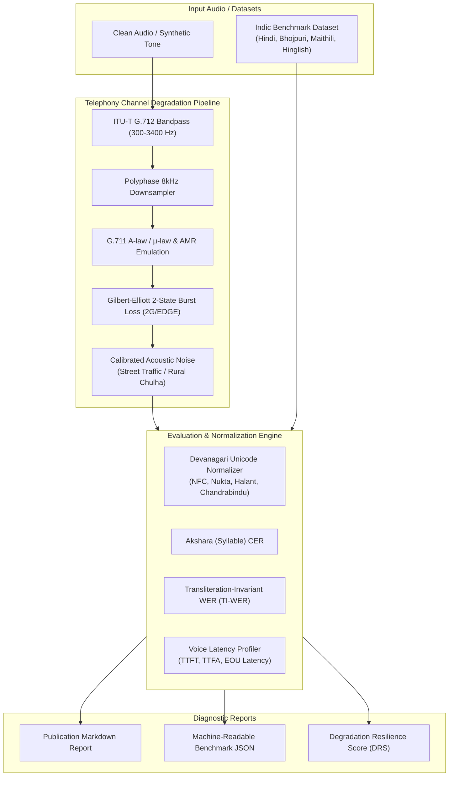

# 015 — dhvani-eval: Telephony-Grade Streaming Voice AI & Indic Evaluation Suite

> **Target Standalone Repo:** `github.com/pritkr/dhvani-eval` (MIT License)  
> **Target Alignment:** SuperKalam (YC AI Applied Engineer - Voice First), Karya (AI Evaluations Research Intern), Gram Vaani (Voice AI & NLP), CivicDataLab (Junior AI Developer).  
> **Identity:** Realistic telephony degradation simulation & vernacular speech evaluation harness for Indic languages (Hindi, Bhojpuri, Maithili, Hinglish).

---

## 1. Executive Summary & Problem Formulation

Mainstream speech evaluation tools (like HuggingFace `evaluate`, `jiwer`, and OpenAI benchmarks) evaluate speech models on pristine studio English audio. When deploying voice AI in rural India (for welfare helplines, agricultural advisory, or student tutoring):
1. **Telephony Codec Distortion:** Voice calls arrive over narrowband 8kHz PSTN/2G networks encoded with G.711 A-law/$\mu$-law or AMR-NB codecs (300 Hz – 3,400 Hz), stripping all high-frequency sibilants.
2. **Burst Packet Drops & Jitter:** 2G cellular towers in rural Bihar and Uttar Pradesh suffer severe packet dropouts during tower handoffs, causing temporal dropouts that trigger catastrophic hallucinations in transformer ASR models.
3. **Devanagari Unicode Ambiguities:** Arbitrary font encodings, nukta variations ($क़$ vs $क + ़$), Chandrabindu ($ँ$) vs Anusvara ($ं$), and zero-width joiners cause false word error penalties in naive Levenshtein distance.
4. **Code-Mixed Colloquial Dialects:** Hindi, Bhojpuri, Maithili, and Hinglish code-switching have multiple valid transliterations and colloquial synonyms (*kyun* vs *kyu*, *theek* vs *thik*, *namaste* vs *namaskar*).

`dhvani-eval` is an open-source evaluation suite and acoustic channel simulator that benchmarks voice AI models against the physical realities of low-bandwidth rural networks.

---

## 2. System Architecture



---

## 3. Mathematical & Algorithmic Formulations

### 3.1 Gilbert-Elliott 2-State Markov Packet Loss Model
Packet dropouts in rural 2G/EDGE networks are bursty rather than independent and identically distributed (i.i.d.). The channel is modeled as a 2-state Markov chain:
- **Good State ($G$):** Packet loss probability $P(L|G) = 0$.
- **Bad State ($B$):** Packet loss probability $P(L|B) = 1$.
- Transition probabilities $P(G \to B) = p$ and $P(B \to G) = r$.

$$\text{Average Burst Length: } L_B = \frac{1}{r}, \quad \text{Overall Loss Rate: } P_L = \frac{p}{p + r}$$

When a packet is dropped, configurable Packet Loss Concealment (PLC) modes simulate receiver behavior: `zero_fill`, `comfort_noise` ($-45\text{ dBFS}$), or `frame_repeat` with exponential amplitude decay.

### 3.2 ITU-T G.711 A-law Compression
Vectorized quantization mapping continuous amplitudes $x \in [-1, 1]$ to 8-bit companded integers:

$$F(x) = \operatorname{sgn}(x) \begin{cases} \frac{A |x|}{1 + \ln(A)}, & 0 \le |x| < \frac{1}{A} \\ \frac{1 + \ln(A |x|)}{1 + \ln(A)}, & \frac{1}{A} \le |x| \le 1 \end{cases} \quad \text{where } A = 87.6$$

### 3.3 Degradation Resilience Score (DRS)
Quantifies model endurance when transitioning from clean audio to telephony-degraded audio:

$$\Delta \text{WER} = \text{WER}_{\text{degraded}} - \text{WER}_{\text{clean}}$$
$$\text{DRS} = \max\left(0, 1.0 - \max(0, \Delta \text{WER})\right) \times 100\%$$

A model with $\text{DRS} \ge 85\%$ is deemed robust for rural deployment.

---

## 4. Standalone Repository Blueprint

```
dhvani-eval/
├── .github/
│   └── workflows/
│       ├── ci.yml                 # pytest, flake8, mypy, packaging checks
│       └── publish.yml            # PyPI distribution build & upload
├── dhvani/
│   ├── __init__.py                # Clean API exports
│   ├── metrics.py                 # Devanagari normalizer, Akshara CER, TI-WER, Latency tracker
│   ├── telephony.py               # G.711 A-law/μ-law, Gilbert-Elliott burst loss, noise simulator
│   ├── evaluator.py               # Benchmark runner, dialect breakdown & markdown generator
│   └── cli.py                     # Full CLI ('eval', 'benchmark', 'report', 'degrade', 'synth')
├── examples/
│   ├── sample_indic_eval.json     # Curated Indic dataset (Hindi, Bhojpuri, Maithili, Hinglish)
│   └── generate_sample_audio.py   # Pure Python synthetic Devanagari audio generator
├── tests/
│   ├── test_metrics.py            # Unit tests for Devanagari normalization & WER/CER
│   ├── test_telephony.py          # Unit tests for G.711 codecs & noise SNR
│   └── test_evaluator.py          # Unit tests for benchmark pipeline & resilience index
├── pyproject.toml                 # Modern PEP 621 packaging
├── requirements.txt               # numpy, scipy
├── Dockerfile                     # Isolated benchmarking container
├── LICENSE                        # MIT License
└── README.md                      # Equations, benchmarks, dialect breakdown & CLI docs
```

---

## 5. Work Breakdown by Aspect

- **Aspect A (Acoustic & DSP Engine):** G.711 codecs, ITU-T bandpass, Gilbert-Elliott burst loss, audio synthesis generator.
- **Aspect B (Indic Phonetics & Evaluation):** Akshara abugida syllabification, Devanagari normalizer, Hinglish transliteration invariance, streaming latency profiler.
- **Aspect C (CLI, Reports & Packaging):** Standalone CLI commands, rich markdown report generator, Dockerfile, GitHub Actions CI, MIT LICENSE.
