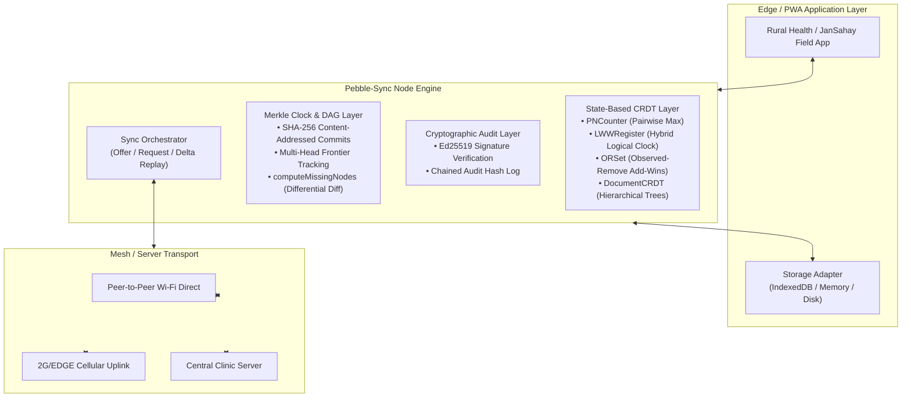

# 016 — pebble-sync: Ultra-Compact Offline-First CRDT Sync Engine with Merkle Clocks

> **Target Standalone Repo:** `github.com/pritkr/pebble-sync` (MIT License)  
> **Target Alignment:** Ente.io (E2EE sync & photo cloud), ByteDance (Distributed NoSQL Database Systems), FOSS United Grants & Fellowships, JanSahay evolution.  
> **Identity:** Zero-dependency, offline-first state-based CRDT engine with Merkle clocks & cryptographic audit chains for edge, rural, and browser environments.

---

## 1. Executive Summary & Problem Formulation

In rural regions, field operations (healthcare workers, welfare scheme enrollment, agricultural surveys) take place in complete cellular blackouts. Current "offline-first" approaches fail:
1. **Timestamp Conflicts & Silent Data Loss:** Naive Last-Write-Wins based on client wall-clocks cause massive data loss when clocks drift or concurrent updates occur across partitioned field units.
2. **Bandwidth Bloat over 2G/EDGE:** Existing CRDT engines (Automerge, Yjs) frequently synchronize full state histories or bloated transaction logs, saturating flaky 2G connections.
3. **Lack of Cryptographic Verifiability:** In peer-to-peer or untrusted mesh sync, nodes cannot cryptographically prove that a received update was authorized and unmodified.

`pebble-sync` is a lightweight, zero-dependency state-based CRDT engine written in TypeScript. It combines bounded state-based CRDTs, Merkle Clock differential compaction (reducing wire payloads by >80%), and Ed25519 digital signature chains for verifiable, zero-trust edge synchronization.

---

## 2. System Architecture



---

## 3. Mathematical & Algorithmic Formulations

### 3.1 Bounded Join-Semilattices $(S, \sqcup)$
All state mutations form a bounded join-semilattice equipped with a partial order $\le$ and a least upper bound (join) operation $\sqcup$:
1. **Commutativity:** $x \sqcup y = y \sqcup x$
2. **Associativity:** $(x \sqcup y) \sqcup z = x \sqcup (y \sqcup z)$
3. **Idempotency:** $x \sqcup x = x$
4. **Monotonicity:** $x \le x \sqcup y$

These four properties guarantee that regardless of network packet reordering, delays, or duplicate gossiping, all nodes that receive the same set of operations are mathematically guaranteed to converge to the identical state.

### 3.2 Merkle Clock Differential Sync
Instead of transmitting the full document state $S$, two nodes $A$ and $B$ exchange only their Merkle frontier roots $H_A$ and $H_B$. Node $A$ computes the minimal missing delta set:

$$\Delta_{A \setminus B} = \operatorname{computeMissingNodes}(F_B) = \{ v \in V_A \mid v \notin \operatorname{Ancestors}(F_B) \}$$

Over high-latency 2G links, this slashes transmitted wire payload from tens of kilobytes to a few hundred bytes.

### 3.3 Chained Cryptographic Tamper-Evidence
Every applied delta is content-addressed and appended to an immutable hash chain:

$$H_n = \operatorname{SHA256}(n \parallel H_{n-1} \parallel \operatorname{Hash}(\Delta_n) \parallel T_n)$$
$$\sigma_n = \operatorname{Sign}_{\text{Ed25519}}(\text{PrivateKey}_{\text{author}}, H_n)$$

Any unauthorized tampering, history insertion, or state alteration breaks the hash chain, triggering instant rejection by all peer nodes.

---

## 4. Standalone Repository Blueprint

```
pebble-sync/
├── .github/
│   └── workflows/
│       ├── ci.yml                 # bun test, tsc typecheck, linting
│       └── release.yml            # npm publish workflow
├── src/
│   ├── crdt/                      # PNCounter, LWWRegister, ORSet, DocumentCRDT
│   ├── merkle/                    # Merkle Clock, DAG, diffing & compaction
│   ├── crypto/                    # Ed25519 keypair signing & SHA-256 audit chain
│   ├── storage/                   # StorageAdapter interface, Memory & IndexedDB adapters
│   ├── network/                   # Simulated mesh network, partition & split-brain tester
│   ├── sync/                      # PebbleSyncNode orchestrator & gossip protocol
│   ├── types.ts                   # Core interfaces and types
│   └── index.ts                   # Main library entrypoint
├── tests/
│   ├── crdt.test.ts               # Algebraic semilattice law proofs
│   ├── merkle.test.ts             # Differential DAG diffing & compaction
│   ├── audit.test.ts              # Cryptographic tamper detection
│   └── partition_convergence.test.ts # 5-node severe split-brain convergence test
├── examples/
│   └── rural_health_sync.ts       # ASHA worker offline hill clinic simulation
├── package.json                   # Zero dependencies, dual ESM/CJS build
├── tsconfig.json                  # Strict TypeScript configuration
├── LICENSE                        # MIT License
└── README.md                      # Architecture, mathematical proofs, benchmarks & API docs
```

---

## 5. Work Breakdown by Aspect

- **Aspect A (Core CRDTs & Merkle DAG):** Join-semilattices, delta replication, Merkle differential diffing.
- **Aspect B (Cryptographic Security & Storage):** Ed25519 signatures, audit hash chains, browser IndexedDB storage adapter.
- **Aspect C (Packaging, Simulation & CI):** Rural health example, 5-node partition simulation, GitHub Actions CI, MIT LICENSE.
