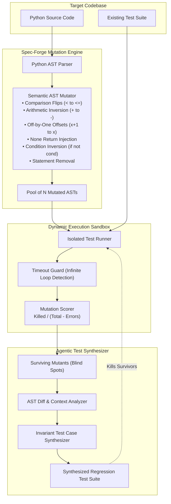

# 017 — spec-forge: Autonomous Agentic AST Mutation Testing & Semantic Invariant Verifier

> **Target Standalone Repo:** `github.com/pritkr/spec-forge` (MIT License)  
> **Target Alignment:** Cursor (AI IDE agent tooling), SkillsCapital (Agentic AI), LetzBizz (FastAPI + Agentic AI), Frappe (Open Source Reliability).  
> **Identity:** Autonomous agentic code verification and AST-preserving mutation testing engine that hunts blind spots in AI-generated code.

---

## 1. Executive Summary & Problem Formulation

With the widespread adoption of AI coding assistants (Cursor, Claude Code, GitHub Copilot), repositories routinely report high test coverage (>90%). However, **line coverage is a dangerous vanity metric**:
1. **Unasserted Lines:** AI code generators often write tests that execute code paths without asserting invariants on return states or exceptions.
2. **Boundary Off-by-One Regressions:** Comparison operations (`<` vs `<=`) and index offsets frequently survive tests undetected.
3. **Null / None Invariant Failures:** AI models frequently assume data will be present, failing silently when `None` or empty states occur.
4. **Superficial Happy-Path Bias:** Tests only exercise happy paths, leaving critical error branches completely unverified.

`spec-forge` solves this by introducing AST-preserving mutation testing paired with an autonomous agentic invariant test synthesizer. It injects synthetic semantic bugs into the Abstract Syntax Tree, identifies surviving mutants (test suite blind spots), and automatically synthesizes targeted regression unit tests that kill the survivors.

---

## 2. System Architecture



---

## 3. Mathematical & Algorithmic Formulations

### 3.1 Mutation Score Formulation
Unlike line coverage (which measures execution without verification), the Mutation Score measures the actual fault-detection effectiveness of a test suite:

$$\text{Mutation Score} = \frac{M_{\text{killed}}}{M_{\text{total}} - M_{\text{equivalent}} - M_{\text{error}}} \times 100\%$$

Where:
- $M_{\text{killed}}$: Mutants that caused at least one test assertion failure.
- $M_{\text{survived}}$: Mutants that passed all tests despite containing a synthetic semantic bug (test suite blind spots).
- $M_{\text{error}}$: Mutants that produced runtime compilation or import errors.

### 3.2 AST Node Substitution Operator
For every node $n \in \operatorname{Nodes}(\text{AST})$ matching a target operator type, a deterministic replacement $n \mapsto n'$ is generated:

$$\Delta_{\text{mutant}}(T) = \operatorname{Transform}(T, n \mapsto n')$$

Each mutant is strictly atomic (contains exactly one syntactic mutation) to isolate the causal failure to a single boundary invariant.

---

## 4. Standalone Repository Blueprint

```
spec-forge/
├── .github/
│   ├── workflows/
│   │   ├── ci.yml                 # pytest, ruff, mutation self-test
│   │   └── release.yml            # PyPI publishing
│   └── actions/
│       └── mutation-gate/         # Reusable GitHub Action for CI pipelines
│           └── action.yml
├── spec_forge/
│   ├── __init__.py                # Version & exports
│   ├── mutator.py                 # AST Visitor & Mutation Operators
│   ├── runner.py                  # Isolated execution & timeout runner
│   ├── scorer.py                  # Score calculator & markdown/JSON reports
│   ├── synthesizer.py             # Autonomous invariant test synthesizer
│   └── cli.py                     # Rich CLI with scan, synthesize, and report
├── examples/
│   ├── target_code.py             # Realistic target module (rate limiter / calculator)
│   └── test_target.py             # Baseline test suite demonstrating blind spots
├── tests/
│   ├── test_mutator.py            # Unit tests for AST mutation operators
│   ├── test_runner.py             # Unit tests for test execution & timeout handling
│   ├── test_scorer.py             # Unit tests for score calculations
│   └── test_synthesizer.py        # Unit tests for test case synthesis
├── pyproject.toml                 # Modern PEP 621 packaging
├── requirements.txt               # click, rich
├── LICENSE                        # MIT License
└── README.md                      # Theory, architecture, CLI commands & CI integration
```

---

## 5. Work Breakdown by Aspect

- **Aspect A (AST Mutation Engine):** 6 mutation operators, boundary off-by-one, null return, statement omission.
- **Aspect B (Isolated Runner & Scorer):** Sandboxed test execution, timeout guard against infinite loops, score computation.
- **Aspect C (Synthesizer, CLI & CI):** Autonomous invariant test generator, rich terminal UI, GitHub Action `action.yml`, MIT LICENSE.
